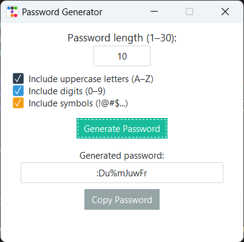

# 🔐 Password Generator

A simple and customizable password generator built with Python and a modern graphical interface using [ttkbootstrap](https://ttkbootstrap.readthedocs.io/). Users can define the password length and choose which character types to include (uppercase, digits, symbols).



## 📦 Features

- Choose password length (1 to 30 characters)
- Select character sets:
  - ✅ Uppercase letters (A–Z)
  - ✅ Digits (0–9)
  - ✅ Symbols (!@#$...)
- Clean and responsive GUI with ttkbootstrap
- Copy password to clipboard with one click
- Icon-enhanced buttons for better UX

## 🛠️ Technologies

- Python 3.x
- [Tkinter](https://docs.python.org/3/library/tkinter.html)
- [ttkbootstrap](https://ttkbootstrap.readthedocs.io/)

## ▶️ How to Run

1. Clone the repository:

   ```bash
   git clone https://github.com/thiagoheinzen/password-generator.git
   cd password-generator
   ```

2. Create a virtual environment (optional but recommended):

   ```bash
   python -m venv .venv
   source .venv/bin/activate  # For Linux/macOS
   .venv\Scripts\activate     # For Windows

   ```

3. Install dependencies:

   ```bash
   pip install -r requirements.txt
   ```
## 🧪 Development Dependencies (optional)

    To generate a standalone executable (.exe), also install:

    ```bash
    pip install -r requirements-dev.txt
    ```
  
4. Run the app:

   ```bash
   python main.py
   ```

## 🪄 Generate Executable (Windows)

To create a `.exe` version:

```bash
pyinstaller --noconsole --onefile --icon=app.ico main.py
```

The executable will be in the `dist/` folder.

## 📁 File Structure

    ```
    password-generator/
    ├── main.py
    ├── icone.ico
    ├── requirements.txt
    ├── requirements-dev.txt
    ├── README.md
    └── .venv/ (optional)

    ```

## 📷 Screenshot


## ✅ To Do

- [ ] Add password strength indicator
- [ ] Allow user to exclude similar characters (e.g., 1/l, 0/O)
- [ ] Add dark mode toggle

## 📄 License

This project is open source and available under the [MIT License](LICENSE).

---

### 👨‍💻 Author

Autieres Thiago Heinzen  
[LinkedIn](https://www.linkedin.com/in/thiagoheinzen) · [GitHub](https://github.com/thiagoheinzen)
